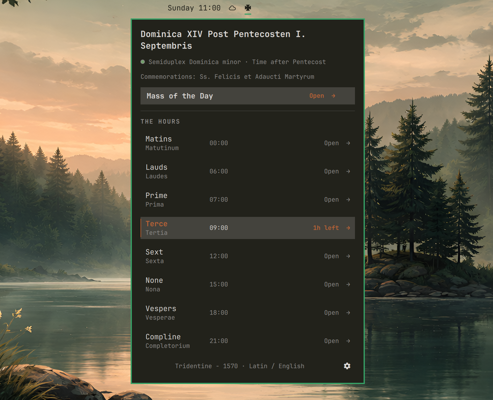
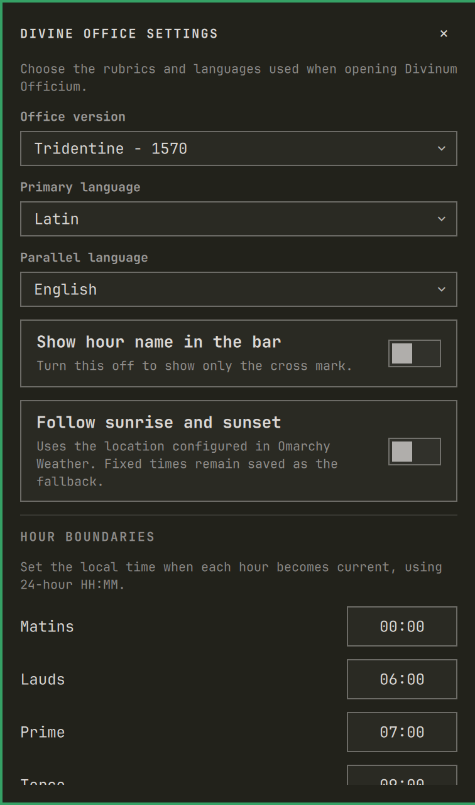

# Divinum Officium for Omarchy

An unofficial [Divinum Officium](https://www.divinumofficium.com/) client for traditional Catholic prayer in the Omarchy bar. It keeps the traditional Roman canonical hours close at hand while leaving the liturgical texts to the open-source Divinum Officium project.



## Features

- A theme-colored Tatzenkreuz in the bar, with an optional current-hour label.
- All eight canonical hours in one panel, with the current hour highlighted and a countdown to the next.
- Direct links to the correct Office and Mass using the selected rubrics and languages.
- The day's feast or Sunday, rank, liturgical season and color, and commemorations.
- A feast-title link to the corresponding date in CatholicSaints.Info's public 1914 Roman Martyrology.
- Fixed custom hour boundaries or a sunrise-and-sunset schedule based on the location configured in Omarchy Weather.
- One lightweight metadata request per day, with a three-day cache, stale-data fallback, and rate-limit cooldowns.

### Settings

Click the gear in the panel's lower-right corner to choose the rubrics, primary and parallel languages, bar label, and hour schedule.



## Install

```bash
omarchy plugin add https://github.com/imr-git/omarchy-divinum-officium.git --enable
```

The widget appears in the center section by default, so no placement command is required after installation. To move it to a different section later, use one of:

```bash
# Left
omarchy bar move io.github.imr-git.divinum-officium --section left

# Center
omarchy bar move io.github.imr-git.divinum-officium --section center

# Right
omarchy bar move io.github.imr-git.divinum-officium --section right
```

Add `--index 0` to place it first in that section, or use `--before <widget-id>` / `--after <widget-id>` for precise ordering. The bar updates immediately.

## Update

Git-managed installations can be updated with:

```bash
omarchy plugin update io.github.imr-git.divinum-officium
```

Omarchy shows the incoming diff, fast-forwards the installed checkout, validates the updated manifest, and rescans the shell. If an affected Omarchy release continues showing the previous QML after the update, restart the shell once:

```bash
omarchy restart shell
```

No cache cleanup is required when updating. The plugin starts a new cache schema when necessary and removes expired metadata during its next successful daily refresh.

## Usage

- Click the cross to open or close the panel.
- Middle-click the cross, or press `R` while the panel is focused, to refresh the liturgical metadata after any active cooldown.
- Click an hour or **Mass of the Day** to open it on Divinum Officium.
- Click the feast title to open that date in the Roman Martyrology.
- Click the gear to edit settings; press `Escape` to close settings or the panel.

## Defaults

- Office version: `Tridentine - 1570`
- Primary language: Latin
- Parallel language: English
- Hour boundaries: Matins 00:00, Lauds 06:00, Prime 07:00, Terce 09:00, Sext 12:00, None 15:00, Vespers 18:00, Compline 21:00
- Schedule mode: fixed times

The optional solar schedule places Matins at the eighth hour of night, Lauds at civil dawn, Prime at sunrise, Terce/Sext/None at the quarter/middle/three-quarter points of daylight, Vespers at sunset, and Compline one hour later. It is a practical approximation: historical monastic timetables varied with season, latitude, work, meals, and the superior's judgment.

## Dependencies and network access

The plugin requires Omarchy's Quickshell bar and Python 3; it uses only Python's standard library. Normally once per civil day for the selected rubrics and languages, its metadata helper requests the lightweight calendar heading from `www.divinumofficium.com`. A settings change or explicit manual refresh can request a new heading, but an active rate-limit cooldown is always enforced. The plugin does not prefetch complete Office or Mass pages; those are opened only when clicked.

Successful metadata is retained for today and the previous three days. During an outage, the most recent matching result remains visible. An HTTP 429 response creates a persistent cooldown using the server's `Retry-After` value, or one hour when none is provided, so reopening or restarting the panel cannot repeatedly contact the service. The panel shows when an active pause ends; once it has ended, the message changes to a manual retry prompt instead of implying that the service is still rate-limiting requests.

Solar events are calculated locally from the coordinates already configured in Omarchy Weather. Those coordinates are not sent to Divinum Officium or another service by this plugin.

Results and rate-limit state are cached under `${XDG_CACHE_HOME:-~/.cache}/omadivoff`.

## Remove

```bash
omarchy plugin remove io.github.imr-git.divinum-officium
```

The metadata cache is intentionally left in `${XDG_CACHE_HOME:-~/.cache}/omadivoff` and can be removed separately if desired.

## Development

```bash
omarchy plugin validate .
/usr/lib/qt6/bin/qmllint -I "$OMARCHY_PATH/shell" BarWidget.qml Panel.qml TatzenkreuzIcon.qml
python3 -m unittest discover -s tests -v
```

Omarchy plugin folders must not contain symlinks.

## Credits and affiliation

The liturgical texts, calendar, and web reader are provided by the MIT-licensed [Divinum Officium project](https://github.com/DivinumOfficium/divinum-officium). This plugin is unofficial, is not affiliated with Divinum Officium, and does not redistribute its liturgical texts.

Solar events use the [NOAA sunrise/sunset equations](https://gml.noaa.gov/grad/solcalc/solareqns.PDF). The traditional mapping is informed by the [Rule of Saint Benedict](https://archive.osb.org/rb/text/toc.html), especially chapters 8, 16, 41, 42, and 48.

## License

MIT
